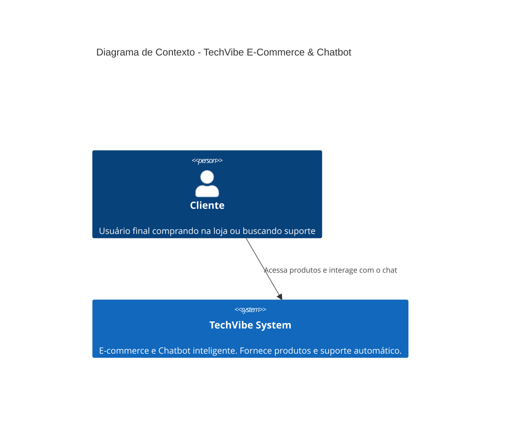
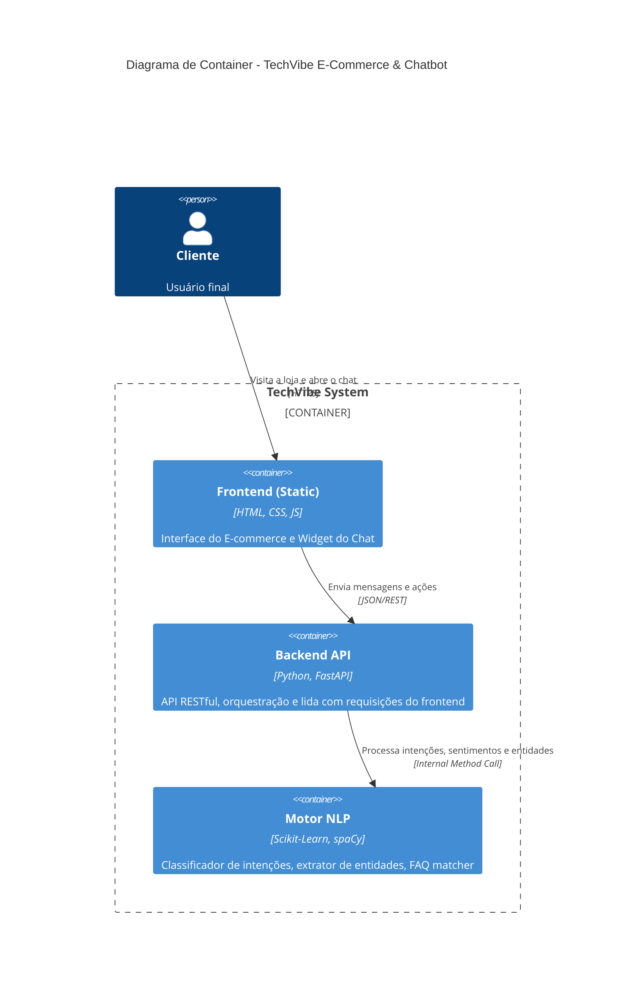

# Arquitetura

O sistema segue uma arquitetura modular baseada em serviços RESTful (FastAPI) acoplado a um motor de Machine Learning para a lógica do bot, comunicando-se com um frontend estático.

## C4 Model - Contexto e Container

## Componentes Principais

1. **Frontend (`app/static/`)**: Serve a interface de e-commerce e o widget de chatbot com os quais os usuários interagem diretamente.
2. **FastAPI Web Server (`app/main.py`)**: Ponto de entrada HTTP que cuida de gerenciar sessões, endpoints `/chat`, `/analytics` e servir arquivos estáticos.
3. **Pipeline NLP (`app/nlp/`)**: 
   - **Classificador de Intenções**: Treinado com algoritmos como Random Forest ou SVM (via Scikit-learn) para determinar o objetivo da mensagem.
   - **FAQ Engine**: Usa TF-IDF e N-gramas para recuperar respostas a perguntas comuns.
   - **NER (Reconhecimento de Entidades)**: Extrai dados estruturados (códigos de rastreio, datas, valores monetários) das mensagens usando spaCy.
   - **Análise de Sentimento**: Classifica a polaridade e emoção do cliente na interação.
4. **Armazenamento de Modelos (`models/`)**: Binários persistidos localmente (ex: arquivos `.pkl`) criados durante o ciclo de treinamento (`train.py`) do motor NLP.
